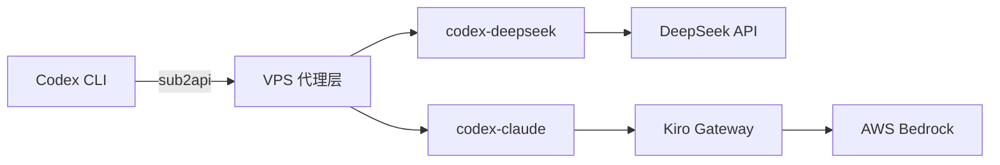

# Codex 兼容层部署与架构记录

本文档记录了部署在 VPS (192.238.232.34) 上的 API 兼容层架构细节。该层作为中间件，将 [[codex-cli]] 的 Responses API 请求转换为标准的 Chat Completions API，从而实现了对 [[deepseek-api]] 和 AWS Bedrock (通过 [[kiro-gateway]]) 的统一调用。

## 核心架构

系统采用三层架构：**本地 CLI → VPS 代理层 → 上游模型**。

## 组件详情

### 1. codex-deepseek
- **端口**: 11435 (Docker 内部)
- **上游**: DeepSeek API (`api.deepseek.com`)
- **功能**: 协议转换与连接池优化
- **关键优化**: 实施了**连接池复用**和 Keep-Alive 机制，解决了默认模式下每次请求新建 TLS 连接导致的严重性能损耗。

### 2. codex-claude
- **端口**: 11436 (Docker 内部)
- **上游**: `kiro-gateway:8000` (最终指向 AWS Bedrock Claude)
- **功能**: 协议转换

### 3. 网络环境
- **Docker 网络**: `sub2api-deploy_sub2api-network`
- **部署路径**: `/opt/codex-deepseek`, `/opt/codex-claude`

## 模型映射策略

通过模型映射屏蔽底层差异，使前端可使用统一标识符：
- `deepseek-v4-pro` ↔ `gpt-5.5` ↔ `claude-opus-4.7`
- `deepseek-v4-flash` ↔ `gpt-5.4` ↔ `claude-sonnet-4.6`

## 已知问题与解决方案

### 1. Docker 网络断连
- **现象**: 当依赖服务（如 [[kiro-gateway]]）重建后，Docker 网络不会自动恢复连接。
- **解决**: 需手动执行 `docker network connect sub2api-deploy_sub2api-network <container_name>` 进行修复。
- **待办**: 需编写自动重启脚本以消除手动运维断点。

### 2. Hermes Agent 密钥截断
- **现象**: [[hermes-agent]] 的 `redact_secrets` 功能会过度防御，自动截断 API Key 导致认证失败。
- **解决**: 采用 Base64 编码对 API Key 进行绕过处理。
- **风险**: 此为临时解决方案，长期需调整 Hermes 配置白名单。

## 相关资源
- [[超梦 API 代理平台]] — 上游聚合服务
- [[Kiro 网关]] — Claude 路由代理
- [[Docker 网络隔离]] — 网络故障理论基础